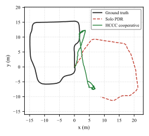
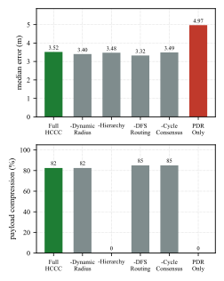
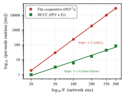

# Hierarchical Closed-Loop Cooperative Localization (HCCC)

**A resource-constrained, cross-layer design for best-achievable-accuracy indoor positioning on commodity smartphones.**

[](LICENSE)
[](HCCC_WCAL2026.pdf)
[](main_wcal.tex)

**Status:** Got Accepted to IPIN 2026 WCAL (Work-in-Progress workshop). 

---

## Overview

Cooperative indoor localization on commodity smartphones is typically framed as an
accuracy-maximization problem. HCCC reframes the objective: **achieve the best
localization accuracy possible under a fixed budget of computation, communication,
and sensing resources.** Cooperating devices are organized into a hierarchy of
aggregation groups so that accuracy scales with the network while per-device cost
stays bounded.

> The contribution is the *design principle* — cooperation should be optimized for
> the resource–accuracy trade-off, not for maximal accuracy — rather than the
> specific five-layer architecture.

## Key Contributions

- **Resource-constrained objective.** Localization error is minimized subject to
  explicit computation, communication, and energy budgets rather than treated as an
  unbounded optimization.
- **Hierarchy for scalability.** Aggregation groups compress raw state into a small
  constant payload (3 scalars/group), keeping per-device cost at `O(V+E)` instead of
  the `O(N³)` / `O(N²)` growth of flat cooperation.
- **Closed-loop coordination.** A cross-layer loop couples pedestrian dead reckoning,
  ranging, and consensus so the system adapts to available resources.
- **Best-achievable accuracy.** Defined as the minimum error attainable under a fixed
  resource envelope, and evaluated against communication-heavy and resource-agnostic
  baselines.

## Method at a Glance



*HCCC reaches the resource-aware operating point: near the accuracy of
communication-heavy cooperation at a fraction of the per-device cost.*

## Results

| Configuration | Mean error | Per-device cost | Complexity |
| --- | --- | --- | --- |
| Flat (communication-heavy) | 0.51 m | `2N` raw exchanges / peer | `O(N³)` |
| HCCC (resource-aware) | 3.49 m | 3 scalars / group | `O(V+E)` |




## Repository Structure

```
hccc-localization-paper/
├── main_wcal.tex          # WCAL 2026 workshop submission (CEUR-WS format)
├── ceurart.cls            # CEUR-WS document class
├── references.bib         # Bibliography
├── fig_*.pdf / fig_*.svg  # Figures
├── HCCC_WCAL2026.pdf      # Compiled paper
├── hccc_sim.py            # Localization simulator
├── validate_real.py       # Real-data validation harness
├── plot_style.py          # Shared figure styling
├── plot_fig2.py           # Figure generation script
└── results.json           # Simulation outputs
```

## Build the Paper

```bash
pdflatex main_wcal
bibtex  main_wcal
pdflatex main_wcal
pdflatex main_wcal
```

## Run the Simulation

```bash
python hccc_sim.py        # reproduce localization results
python validate_real.py   # validate against real traces
```

## Citation

```bibtex
@misc{lai2026hccc,
  title     = {Hierarchical Closed-Loop Cooperative Localization (HCCC):
               A Resource-Constrained, Cross-Layer Design for
               Best-Achievable-Accuracy Indoor Positioning on Commodity Smartphones},
  author    = {Lai, Chun Kit},
  year      = {2026},
  note      = {Submitted to IPIN 2026 WCAL (Work-in-Progress)}
}
```

## License

Code and content in this repository are released under the [MIT License](LICENSE).
The paper, upon acceptance, will be distributed under CC BY 4.0 by CEUR-WS.
